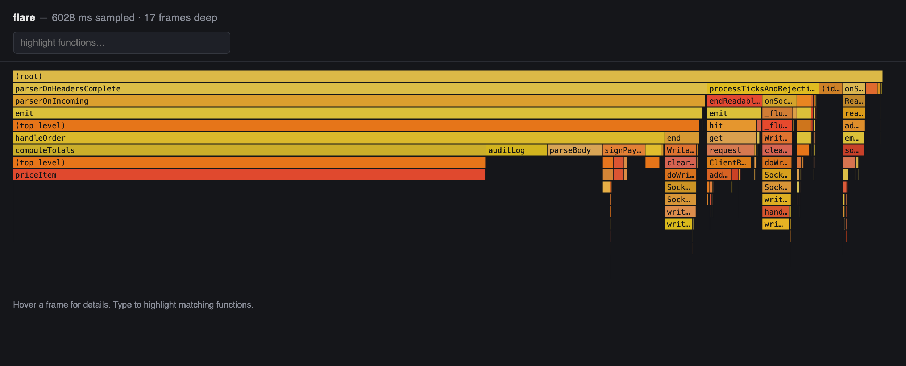

# flare

**Profile a JavaScript process that is already running.** No restart, no code changes, no wrapper command.

```bash
flare 51234
```

That's it. flare attaches to the live process, samples it, and opens a flamegraph in your browser.



*A live Node HTTP server. `priceItem` is 54% of the sampled window — six frames
deep inside a request handler, which is exactly the sort of thing you do not see
until you look.*

---

## Why

Every other Node profiler wants to *launch* your program:

```bash
0x -- node server.js          # relaunch
node --cpu-prof server.js     # relaunch
clinic flame -- node app.js   # relaunch
```

That is fine on your laptop and useless when it matters. The process that is
burning CPU right now is the one you cannot restart — it is serving traffic, it
took forty minutes to reach this state, or the bug only shows up after two days
of uptime. By the time you relaunch it under a profiler, the thing you wanted
to see is gone.

flare attaches to the process as it is.

## Install

```bash
cargo install --git https://github.com/Ketchio-dev/flare
```

Or grab a binary from [releases](../../releases). It is one 1.4 MB file with no
runtime dependencies — no Node module to install, nothing added to your project.

## Use

```bash
flare 51234                        # sample for 10s, open the flamegraph
flare 51234 -d 60                  # sample for a minute
flare 51234 -o slow-checkout.html  # name the output
flare --port 9229                  # attach to an inspector already listening
flare --url ws://127.0.0.1:9229/…  # or to an exact websocket URL
```

Find the pid however you normally would — `ps aux | grep node`, `lsof -i :3000`,
your process manager, `docker top`.

```
→ attached  (ws://127.0.0.1:9229/d1812a8c-…)
→ sampling for 5s at 100µs …
→ captured 38404 samples

4027 ms sampled · 18 frames deep

Hot functions (self time — where the CPU actually was):
   53.7%    2161.6 ms  priceItem                    demo-server.js:8
    9.0%     361.5 ms  auditLog                     demo-server.js:12
    6.7%     268.4 ms  parseBody                    demo-server.js:5

Hottest path (widest branch at each level):
  parserOnHeadersComplete (node:_http_common:77)
    parserOnIncoming (node:_http_server:1256)
      emit (node:events:456)
        handleOrder (demo-server.js:14)
          computeTotals (demo-server.js:9)
            priceItem (demo-server.js:8)

Flamegraph: flare.html
```

You get the answer in the terminal without opening anything. The flamegraph is
there when you want to see the shape of it.

The HTML is a **single self-contained file**. No viewer to install, no
server to run, no upload. The example above is 10 KB — small enough to attach to
an issue or drop in a Slack thread, and it still works on the other person's
machine.

## For coding agents

flare is built to be run by an agent, not just by a person:

```bash
flare --json --no-html          # everything on stdout, nothing interactive
```

```json
{
  "sampled_ms": 3019.7,
  "hot_functions": [
    { "function": "priceItem", "location": "demo-server.js:8",
      "self_ms": 1715.0, "self_pct": 56.8, "total_ms": 1715.8 }
  ],
  "hot_path": ["parserOnIncoming (node:_http_server:1256)", "…", "priceItem (demo-server.js:8)"]
}
```

- **The summary is the output.** Ranked hot functions and the hottest path go to
  stdout as text or JSON. An agent never has to open, screenshot, or parse a
  flamegraph to find out what is slow.
- **stdout is data, stderr is chatter.** Pipe stdout and you get only results.
- **Nothing interactive unless a human is there.** The browser opens only when
  stdout is a terminal, so agents and CI are never interrupted.
- **`flare` with no arguments works** when exactly one Node or Deno process is
  running. If there are several, flare refuses to guess and lists them with
  their pids — signalling the wrong process is not a mistake worth making
  automatically.

## How it works

Node opens its inspector when it receives `SIGUSR1`. That is the whole trick:
flare signals the process, waits for the inspector to bind, then drives V8's
sampling profiler over the Chrome DevTools Protocol and renders the resulting
`.cpuprofile` as an SVG flamegraph.

Self time comes from the sample stream (`samples` + `timeDeltas`) rather than
`hitCount`, because V8's samples are not evenly spaced and the deltas are the
honest measure.

## Runtime support

| Runtime | Attach to a running process | With `--inspect` |
| ------- | --------------------------- | ---------------- |
| Node    | **yes** — `flare <pid>`     | yes              |
| Deno    | no (no signal handler)      | **yes** — `flare --port 9229` |
| Bun     | not yet                     | not yet          |

Bun runs on JavaScriptCore, which speaks WebKit's inspector protocol and has no
CDP `Profiler` domain, so flare cannot profile it yet. Support means
implementing the `ScriptProfiler` domain separately — it is on the list.

## Reading the flamegraph

Width is time. The wider a frame, the more of the sampled window was spent in it
and everything it called. Depth is call stack, not cost — a tall narrow tower is
cheap, a short wide slab is where your time goes.

Type in the search box to highlight matching functions; the status line totals
how much time they account for. Hover any frame for its file, line, total and
self time.

## Caveats

- **Sampling, not tracing.** Work shorter than the sampling interval can be
  missed entirely. Lower `-i` to catch more, at the cost of overhead.
- **Signalling the wrong process is not free.** `SIGUSR1` terminates most
  programs that do not handle it. flare only signals the pid you give it — make
  sure it is the JavaScript one.
- **The inspector is a debugger port.** While it is open, anything that can
  reach it can execute code in your process. It binds to `127.0.0.1` and Node
  keeps it open until the process exits.
- **Native frames are not resolved.** Time inside C++ addons shows up as
  `(program)` rather than a named stack.

## Development

```bash
cargo test              # unit tests over synthetic profiles
cargo clippy --all-targets -- -D warnings
cargo fmt --check
```

CI additionally profiles a real live Node process on every push and asserts the
known hot function comes out on top — the claim on the tin is checked, not
just the code.

## License

MIT
